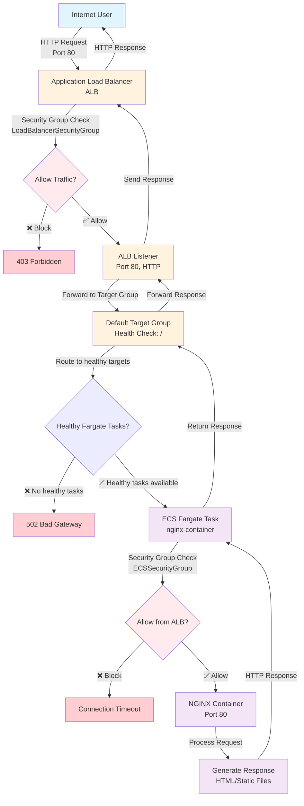

# Request-Response Flow Diagram

## Architecture Flow Chart

## Detailed Request Flow

### 1. Client Request
- **Source**: Internet user/browser
- **Destination**: ALB DNS name
- **Protocol**: HTTP
- **Port**: 80

### 2. Application Load Balancer (ALB)
- **Location**: Public subnets (AZ1 & AZ2)
- **Security Group**: `LoadBalancerSecurityGroup`
  - Allows inbound: Port 80 (HTTP) from 0.0.0.0/0
  - Allows inbound: Port 443 (HTTPS) from 0.0.0.0/0
- **Function**: Route traffic based on listener rules

### 3. ALB Listener
- **Protocol**: HTTP
- **Port**: 80
- **Action**: Forward to `DefaultTargetGroup`
- **Rules**: Default action (no custom routing)

### 4. Target Group
- **Name**: `DefaultTargetGroup`
- **Type**: IP targets (for Fargate)
- **Health Check**: 
  - Path: `/`
  - Protocol: HTTP
  - Port: 80
  - Interval: 10 seconds
  - Timeout: 5 seconds
  - Healthy threshold: 2
  - Unhealthy threshold: 2

### 5. ECS Fargate Service
- **Location**: Private subnets (AZ1 & AZ2)
- **Security Group**: `ECSSecurityGroup`
  - Allows inbound: Port 80 from `LoadBalancerSecurityGroup` only
- **Networking**: ENI with private IP addresses
- **Registration**: Auto-registers with target group

### 6. NGINX Container
- **Image**: `nginx:latest`
- **Port**: 80
- **Resources**: 
  - CPU: 256 units (0.25 vCPU)
  - Memory: 512 MB
- **Logs**: CloudWatch Logs

## Response Codes and Scenarios

### Successful Request Flow (200 OK)
1. Client → ALB → Healthy Fargate task → NGINX → Response
2. **Time**: ~50-200ms typical response time

### Common Error Scenarios

#### 502 Bad Gateway
- **Cause**: No healthy Fargate tasks available
- **Troubleshooting**: Check ECS service status and health checks

#### 503 Service Unavailable
- **Cause**: ALB overwhelmed or target group has no registered targets
- **Troubleshooting**: Check target group registrations

#### 504 Gateway Timeout
- **Cause**: Fargate task taking too long to respond (>30 seconds)
- **Troubleshooting**: Check container logs and application performance

#### Connection Refused
- **Cause**: Security group blocking traffic or container not listening on port 80
- **Troubleshooting**: Verify security group rules and container configuration

This diagram shows the complete request-response flow through your AWS infrastructure!
